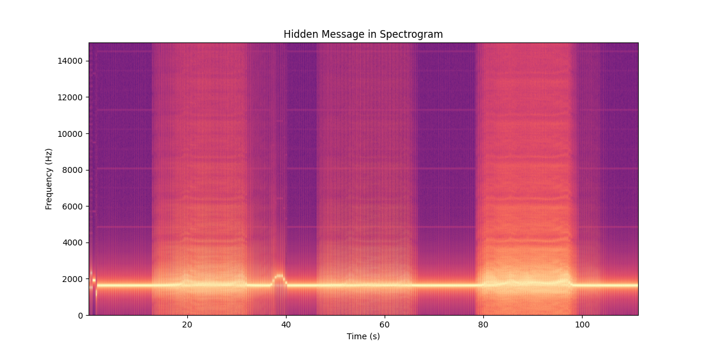
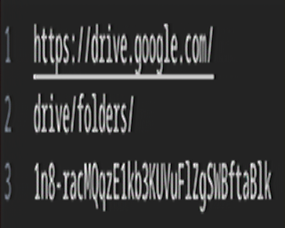
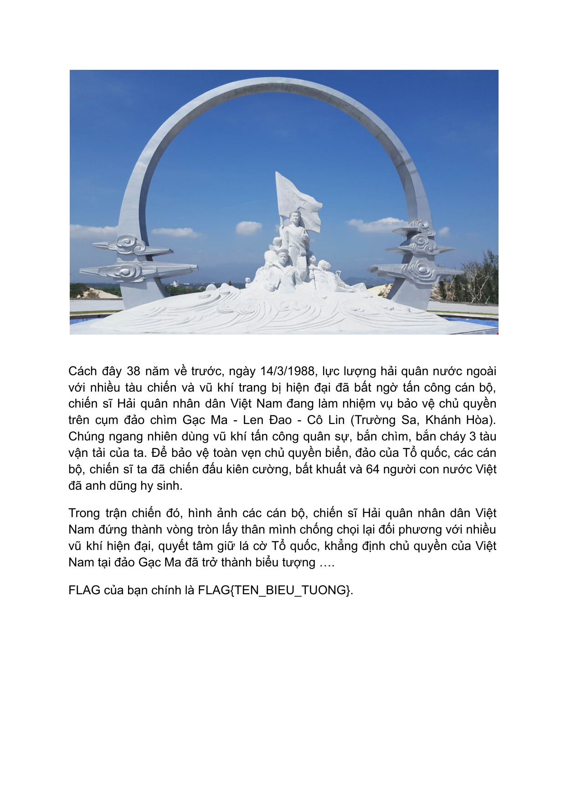

# Vòng 1 — Mệnh lệnh xuất kích
## Given
File challenge cung cấp một bài toán **Discrete Logarithm Problem (DLP)** trên nhóm số nguyên modulo `p`:
```
The flag has been encoded as a secret exponent x, where:

  h = g^x mod p

Your job: find x. Convert it from integer to bytes to get the flag.

p = 2247297901375864750461918215908397462554622316861885697469812609208482671796519989041708819088327406276727713325926984783654453580598954278480933663642628407743971547337698858815665335450301828703735517279088545252493204317839245564990751219121256870972082020870742841156981131437941510099651935803198999627
g = 797032223149531285607971355158192150926555680763341545661871333078567437408820428834941794887222745425244137303956776516613894961185972456200978813725184212858037439841778740577859187417009007458444768864113847557627519817788214445986970343968064264731545268364867143251499664214088696995903599781563984116
h = 468236306785559227242545208642961660487424736475509451324848496240713063884248400928453707063093512040762457493692466389598131256501402625717666645351148316070083773749717409678738689693550470750839264535543953759648092479282888291678698194889269011735062078161680411521433536665807130299043504305373037050
```

## Goal
Tìm số nguyên bí mật `x` thỏa mãn phương trình trên, sau đó chuyển đổi `x` từ số nguyên sang bytes để thu được flag theo format `FLAG{[A-Z0-9_]+}`.

## Solution
- **Bước 1 — Nhận diện lỗ hổng: Smooth `p-1`**

    Ta thấy `p - 1` phân tích thành 45 thừa số nguyên tố, tất cả đều nhỏ hơn 2²⁴ ≈ 16.7 triệu.

    Đây gọi là **B-smooth number**.

    => Sai lầm: trong hệ thống DLP an toàn (như Diffie-Hellman chuẩn), `p` phải là safe prime (tức $p = 2q + 1$ với $q$ nguyên tố lớn), để `p - 1` có ít nhất một thừa số nguyên tố rất lớn. Khi `p - 1` smooth, thuật toán Pohlig-Hellman có thể khai thác.

- **Bước 2 — Pohlig-Hellman Attack**

    **Ý tưởng cốt lõi của Pohlig-Hellman:** thay vì giải DLP trên nhóm có order `p - 1` khổng lồ, chia bài toán thành các DLP nhỏ trên các nhóm con có order là từng thừa số nguyên tố $q_i$, sau đó ghép lại bằng Định lý số dư Trung Hoa (CRT):

    $$x \equiv x_i \pmod{q_i} \quad \text{với mỗi thừa số } q_i \mid (p - 1)$$

    Vì tất cả $q_i < 2^{24}$, mỗi DLP con có thể giải bằng \textbf{Baby-step Giant-step} trong $O(\sqrt{q_i}) \approx O(2^{12})$ bước — cực kỳ nhanh.

- **Bước 3 - Decode flag**

    Sau khi Pohlig-Hellman tìm ra `x` (là một số nguyên lớn), ta cần chuyển số đó thành chuỗi ký tự.

## Code
```py
import math
from functools import reduce


p = 2247297901375864750461918215908397462554622316861885697469812609208482671796519989041708819088327406276727713325926984783654453580598954278480933663642628407743971547337698858815665335450301828703735517279088545252493204317839245564990751219121256870972082020870742841156981131437941510099651935803198999627
g = 797032223149531285607971355158192150926555680763341545661871333078567437408820428834941794887222745425244137303956776516613894961185972456200978813725184212858037439841778740577859187417009007458444768864113847557627519817788214445986970343968064264731545268364867143251499664214088696995903599781563984116
h = 468236306785559227242545208642961660487424736475509451324848496240713063884248400928453707063093512040762457493692466389598131256501402625717666645351148316070083773749717409678738689693550470750839264535543953759648092479282888291678698194889269011735062078161680411521433536665807130299043504305373037050


def bsgs(g, h, p, order):
    m = math.isqrt(order) + 1
    table = {}
    gj = 1
    for j in range(m):
        table[gj] = j
        gj = gj * g % p
    g_inv_m = pow(g, p - 1 - m, p)
    gamma = h
    for i in range(m):
        if gamma in table:
            x = i * m + table[gamma]
            if x < order:
                return x % order
        gamma = gamma * g_inv_m % p
    return None


def extended_gcd(a, b):
    if a == 0:
        return b, 0, 1
    gcd, x1, y1 = extended_gcd(b % a, a)
    return gcd, y1 - (b // a) * x1, x1


def crt(residues, moduli):
    M = reduce(lambda a, b: a * b, moduli)
    x = 0
    for r, m in zip(residues, moduli):
        Mi = M // m
        _, inv, _ = extended_gcd(Mi % m, m)
        x += r * Mi * inv
    return x % M


def pohlig_hellman(g, h, p, factors):
    n = p - 1
    residues, moduli = [], []
    for q, e in factors.items():
        qe = q ** e
        gi = pow(g, n // qe, p)
        hi = pow(h, n // qe, p)
        if e == 1:
            xi = bsgs(gi, hi, p, q) or 0
        else:
            xi = 0
            gamma = pow(gi, qe // q, p)
            for k in range(e):
                hk = pow(pow(g, xi, p) * pow(h, p - 2, p) % p, n // q**(k+1), p)
                dk = bsgs(gamma, pow(hk, p - 2, p), p, q) or 0
                xi = (xi + dk * q**k) % qe
        residues.append(xi)
        moduli.append(qe)
    return crt(residues, moduli)


# Bước 1: Phân tích p-1
from sympy import factorint
factors = factorint(p - 1)
print(len(factors))

# Bước 2: Giải DLP
x = pohlig_hellman(g, h, p, factors)

# Bước 3: Verify & decode
assert pow(g, x, p) == h, "Verification failed!"
flag = x.to_bytes((x.bit_length() + 7) // 8, "big").decode("utf-8")
print(flag)
```

## Flag
`FLAG{HQ604}`

# VÒNG 2 — Tọa độ điểm mù
## Given
File ảnh `holdtheflag.png` chỉ là một màu đen, đi kèm với đoạn mô tả chứa manh mối quan trọng: "Ở đây tối quá, chẳng nhìn thấy gì cả."

## Goal
Phân tích bức ảnh, tìm cách làm lộ ra các thông tin bị giấu trong vùng tối để tìm được tọa độ/tên địa danh, từ đó định dạng lại thành Flag hợp lệ theo chuẩn `FLAG{[A-Z0-9_]+}`.

## Solution
- Ảnh tối nhưng các text label vẫn đọc được khi tăng độ sáng/contrast. 

- Ta đọc 3 tên theo thứ tự từ nổi bật nhất -> ít nổi bật hơn (theo sự kiện lịch sử: Gạc Ma là nơi xảy ra trận chiến chính):

    ```
    GAC_MA -> CO_LIN -> LEN_DAO
    ```

## Flag
`FLAG{GAC_MA_CO_LIN_LEN_DAO}`


# VÒNG 3 — Bức thư nhà gửi vội
## Given
- Một bức ảnh chứa chuỗi ký tự trên nền giấy cũ: `SU9ESntXVURRX1lEUV9TS1hSUUp9`

- Các dữ kiện gợi ý: 
    - "Lớp ngoài trông quen. Lớp trong thì không. Chìa khóa không nằm trong bức thư" 
    - Thông tin về một người Anh hùng Lực lượng vũ trang hy sinh khi giữ chặt cán cờ đảo ở tuổi đôi mươi.

## Goal
Giải mã chuỗi ký tự qua nhiều lớp (layers) để tìm ra thông điệp ẩn bên trong, đối chiếu với dữ kiện lịch sử để xác nhận và định dạng thành cờ `FLAG{[A-Z0-9_]+}`.

## Solution
- **Bước 1 - Giải mã lớp ngoài (Base64)**

    - Chuỗi `SU9ESntXVURRX1lEUV9TS1hSUUp9` bao gồm các chữ cái hoa, thường và số, mang đặc trưng điển hình của Base64. 
    
    - Thực hiện decode Base64 chuỗi này, ta thu được chuỗi mới: `IODJ{WUDQ_YDQ_SKXRUJ}`.

- **Bước 2 - Phân tích lớp trong (Caesar Cipher)**

    - Chuỗi `IODJ{...}` có cấu trúc cực kỳ giống với định dạng `FLAG{...}`. 

    - Gợi ý "Lớp trong thì không" và "chìa khóa không nằm trong bức thư" chỉ ra rằng ta cần tự tìm **độ lệch của hệ mã hóa thay thế Caesar**.

- **Bước 3 - Tìm khóa và giải mã**

    - So sánh chữ `F` trong chữ "FLAG" và chữ `I` trong chuỗi giải mã: `F` tiến lên 3 bước trong bảng chữ cái sẽ thành `I` (F -> G -> H -> I).

    - Tương tự:
        - `L` + 3 = `O`
        - `A` + 3 = `D`
        - `G` + 3 = `J`.

    - Vậy mã này đã bị dịch chuyển +3 (ROT3). Để giải mã, ta cần dịch chuyển ngược lại -3 (ROT23) cho toàn bộ các chữ cái trong chuỗi. Ta được: `FLAG{TRAN_VAN_PHUONG}`

## Code
```py
import base64

encoded_str = "SU9ESntXVURRX1lEUV9TS1hSUUp9"
decoded_b64 = base64.b64decode(encoded_str).decode('utf-8')

flag = ""
for char in decoded_b64:
    if char.isalpha():
        shift_base = 65 if char.isupper() else 97
        flag += chr((ord(char) - shift_base - 3) % 26 + shift_base)
    else:
        flag += char

print(flag)
```

# VÒNG 4 — Vòng tròn bất tử
## Given
File âm thanh `challenge.wav` chứa tiếng rè liên tục và chói tai. Gợi ý đi kèm: "Sóng radio chỉ còn tiếng rè... thông điệp cuối, không bằng lời, không bằng chữ. Bạn cần nghe bằng một cách khác."

## Goal
Tìm flag theo định dạng `FLAG{[A-Z0-9_]+}`.

## Solution
- **Bước 1 - Dùng Python vẽ ra phổ đồ âm thanh từ file**

    ```py
    import matplotlib.pyplot as plt
    from scipy.io import wavfile

    # Đọc file audio
    sample_rate, data = wavfile.read('challenge.wav')

    # Nếu audio có 2 kênh (stereo), chỉ lấy 1 kênh để xử lý
    if len(data.shape) > 1:
        data = data[:, 0]

    # Vẽ và cấu hình Spectrogram
    plt.figure(figsize=(12, 6))
    # NFFT càng cao thì độ phân giải dải tần càng chi tiết
    plt.specgram(data, Fs=sample_rate, NFFT=1024, cmap='magma') 

    plt.title('Hidden Message in Spectrogram')
    plt.ylabel('Frequency (Hz)')
    plt.xlabel('Time (s)')
    plt.ylim(0, 15000) # Giới hạn tần số để text hiện ra rõ nhất (có thể tinh chỉnh)

    # Lưu kết quả ra file ảnh để đọc Flag
    plt.savefig('spectrogram_flag.png')
    print("Đã giải mã âm thanh! Hãy mở file spectrogram_flag.png để lấy cờ.")
    ```

    

- **Bước 2 - Phân tích tín hiệu**

    - Hãy chú ý đến vệt sáng nằm ngang cực kỳ rõ nét ở khoảng tần số 1500 Hz đến 2300 Hz.

    - Đường sáng này dao động liên tục kèm theo các dải màu dọc xen kẽ thành từng khối. Đây chính là "chữ ký" kinh điển của tín hiệu **SSTV (Slow-Scan Television)** — một giao thức dùng để truyền hình ảnh tĩnh qua sóng vô tuyến (radio).

    - Điều này khớp hoàn hảo với gợi ý của đề bài: "sóng radio" và thông điệp "không bằng lời, không bằng chữ".

    - Dùng phần mềm **MMSSTV** để giải mã ta được:

        

    - Truy cập vào link ta thấy 2 file mới: `chall.py` và `output.txt`.

- **Bước 3 - Phân tích hai file vừa tìm được**

    - Ta thấy `chall.py` tự cài đặt thuật toán AES chế độ **CTR (Counter Mode)** để mã hóa một file ảnh `flag.png` và xuất kết quả ra file `output.txt`. Khóa `KEY` bị ẩn.

    - Trong lớp `AES_CTR`, hàm `increment()` có nhiệm vụ thay đổi giá trị của biến đếm để tạo ra keystream thay đổi liên tục cho mỗi khối 16 bytes. Tuy nhiên, hàm `encrypt_challenge()` lại khởi tạo `cipher = AES_CTR(KEY, step_up=False)`.

    - Khi `step_up=False` (tức là `self.stup = False`), đoạn code tính toán IV mới sẽ nhảy vào nhánh `else`:

        `self.newIV = hex(int(self.value, 16) - self.stup)`

    - Trong Python, giá trị `False` khi đưa vào phép tính toán học sẽ tương đương với số `0`. Do đó, phép trừ này thực chất là trừ đi 0. Biến đếm không bao giờ tăng/giảm khiến `keystream` được sinh ra bị **cố định** trong toàn bộ quá trình mã hóa file.

    - Thuật toán CTR sử dụng phép XOR:

    $$Ciphertext = Plaintext \oplus Keystream$$

    $$=> Keystream = Ciphertext \oplus Plaintext$$

    - Vì ta biết định dạng file gốc là ảnh PNG (qua dòng `open("flag.png", 'rb')`), nên 16 bytes đầu tiên của bản rõ (Plaintext) chắc chắn là chữ ký đặc trưng (Magic Bytes) của mọi file PNG: `89 50 4E 47 0D 0A 1A 0A 00 00 00 0D 49 48 44 52`.

    - Ta lấy 16 bytes đầu tiên của file `output.txt` đem XOR với 16 bytes PNG Header để tìm ra chuỗi `keystream` bị kẹt. Sau đó, đem chuỗi `keystream` này XOR ngược lại với toàn bộ dữ liệu của `output.txt` để khôi phục ảnh.

    ```py
    # PNG Header (16 bytes đầu tiên của mọi file PNG)
    png_header = bytes.fromhex("89504E470D0A1A0A0000000D49484452")

    # Đọc dữ liệu đã mã hóa
    with open(r"D:\HoldTheFlag\V4\output.txt", "r") as f:
        ciphertext_hex = f.read().strip()
    ciphertext = bytes.fromhex(ciphertext_hex)

    # Lấy 16 byte ciphertext đầu tiên
    first_block = ciphertext[:16]

    # Tìm Keystream (vì Keystream bị cố định)
    # Keystream = Ciphertext ^ Plaintext
    keystream = bytes(a ^ b for a, b in zip(first_block, png_header))

    # Khôi phục file ảnh (Giải mã)
    decrypted_data = bytearray()
    for i in range(0, len(ciphertext), 16):
        block = ciphertext[i:i+16]
        current_keystream = keystream[:len(block)]
        decrypted_block = bytes(a ^ b for a, b in zip(block, current_keystream))
        decrypted_data.extend(decrypted_block)

    # Lưu kết quả
    with open(r"D:\HoldTheFlag\V4\flag_decrypted.png", "wb") as f:
        f.write(decrypted_data)
    ```

    - Cuối cùng ta thu được ảnh:
    

## Flag
`FLAG{VONG_TRON_BAT_TU}`

# Vòng 5 - Khúc tráng ca
## Given
- File `HQ604.abc`.

- Đoạn gợi ý nhắc đến: "Một chuỗi ký tự lạ", và "một chìa khóa mà bạn đã biết từ đầu".

## Goal
Trích xuất chuỗi ký tự bị giấu trong file, xác định đúng chìa khóa để giải mã, sau đó khôi phục lại bản rõ (Plaintext) và định dạng thành cờ `FLAG{[A-Z0-9_]+}`.

## Solution
- **Bước 1 - Tìm chuỗi ký tự lạ**

    - Cố gắng mở file `HQ604.abc` bằng trình soạn thảo văn bản (Text Editor/Notepad), ta thấy phần đầu của file có cụm ký hiệu `JFIF` (đặc trưng của file ảnh JPEG).
    
    - Tuy nhiên, ngay kế bên nó lại bị chèn một chuỗi Hex: `0b19636f651d08737e6b1c197f757a0f0e7a79710616`.

- **Bước 2 - Tìm Key**
    - Gợi ý nói rằng chìa khóa là thứ "bạn đã biết từ đầu". 
    => Xâu chuỗi với bối cảnh lịch sử và chính tên của file được giao, chìa khóa giải mã ở đây chính là tên con tàu huyền thoại: `HQ604`.

- **Bước 3 - Giải mã (XOR Decryption)**
    Ta sẽ tiến hành lấy chuỗi Hex vừa tìm được đem XOR với chuỗi khóa `HQ604` (lặp lại khóa cho đến khi hết chiều dài chuỗi mã hóa)

## Code
```py
# Chuỗi hex tìm được trong header của file
hex_string = "0b19636f651d08737e6b1c197f757a0f0e7a79710616"
ciphertext = bytes.fromhex(hex_string)

# Khóa giải mã chính là tên file
key = b"HQ604"

# Tiến hành giải mã XOR
plaintext = bytearray()
for i in range(len(ciphertext)):
    # XOR từng byte của ciphertext với byte tương ứng của key (lặp vòng)
    decrypted_byte = ciphertext[i] ^ key[i % len(key)]
    plaintext.append(decrypted_byte)

# In kết quả
flag_content = plaintext.decode('utf-8')
print(f"FLAG{{{flag_content}}}")
```

## Flag
`FLAG{CHU_QUYEN_THIENG_LIENG}`